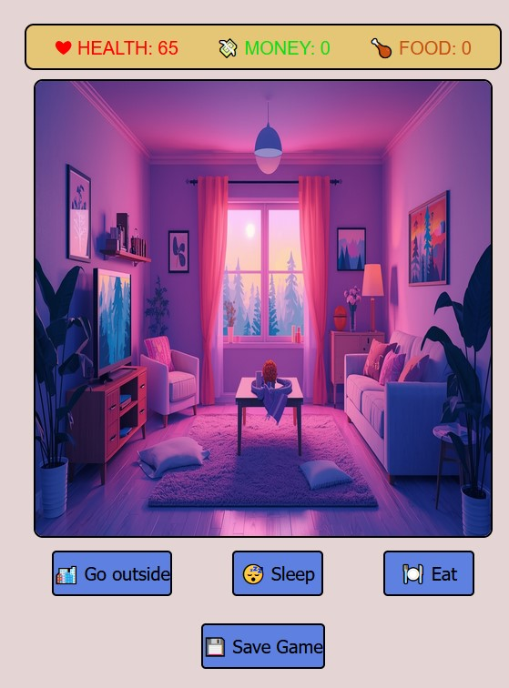

# 🏡 Mini Life Game — React Pet Project

Небольшая браузерная игра, созданная как пет-проект на **React + Vite + TypeScript**, в которой игрок управляет действиями персонажа, перемещаясь между локациями и выполняя различные действия.

Игрок следит за **здоровьем, деньгами и едой**, а окружение постепенно реагирует на его действия:  
— в офисе печатается отчёт,  
— на стройке постепенно появляется здание,  
— дома можно спать, есть или выходить на улицу.

---

## 🎮 Особенности игры

### 🌇 Локации

Каждая локация имеет собственные действия и визуальное оформление.

#### 🏠 Дом

Доступные действия:

- **Спать** — восстанавливает здоровье
    
- **Есть** — восполняет еду
    
- **Выйти на улицу**
    

#### 🚶 Улица

Доступные действия:

- **Работа**
    
- **Магазин**
    
- **Домой**
    

#### 💼 Работа

Два направления:

- **Офис** — при нажатии кнопки постепенно печатается отчёт
    
- **Стройка** — при взаимодействии постепенно появляется здание на экране
    

---

## 🧩 Геймплейные элементы

- 🧡 **Health** — здоровье
    
- 💰 **Money** — деньги
    
- 🍗 **Food** — запас еды
    
- 💾 **Сохранение** — возможность сохранить прогресс
    

---

## 🛠️ Стек технологий

- **React**
    
- **Vite**
    
- **TypeScript (TSX)**
    
- CSS / UI-компоненты по проекту
    

---

## 🚀 Как запустить проект

# Клонировать репозиторий 
```bash
git clone git remote add origin https://github.com/TahmazovAziz/React-mini-Game.git  
cd  React-mini-Game 
```

# Установить зависимости 
```bash
npm install
```
# Запустить проект в dev-режиме npm run dev`
```bash
npm run dev
```

---

## 🖼️ Скриншот




---

## 🙌 Автор

Проект создан как пет-проект в свободное время — для практики React и TypeScript и просто удовольствия от разработки.